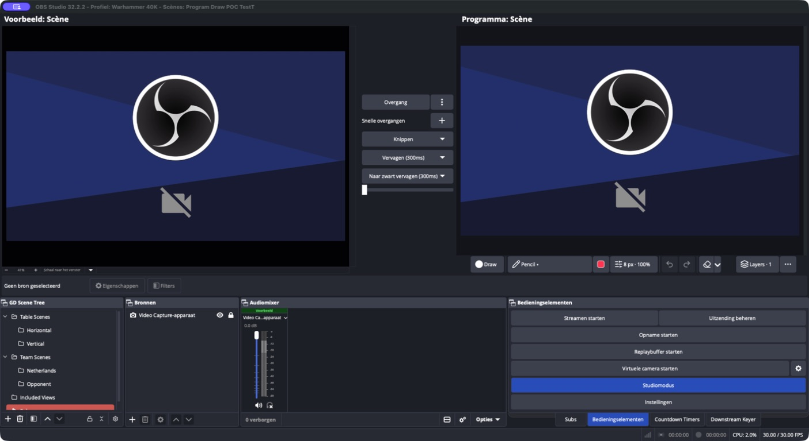

# GD Program Draw

Draw on your live video in OBS Studio. Mark a player, sketch a route or point
out a detail while you talk. Everything you draw appears on stream and in
recordings.

The toolbar sits below the video and works in both normal mode and Studio
Mode.

## Install

Download a build from [GitHub Actions](https://github.com/ronplanken/gd-program-draw/actions).
Open the latest successful **main push run** and scroll down to **Artifacts**.

| Platform | Download |
| --- | --- |
| Windows x64 | Installer EXE or ZIP |
| macOS, Intel and Apple Silicon | Universal PKG installer |
| Ubuntu 24.04 x86_64 | DEB package |

Close OBS, run the installer for your platform, then reopen OBS. If you use
the Windows ZIP, extract the `gd-program-draw` folder into
`%ProgramData%\obs-studio\plugins\`.

If you installed an earlier proof of concept, remove `obs-program-draw.plugin`
first so OBS doesn't load two copies.

## Start drawing

Click the filled-circle **Draw** button, choose a tool, then draw on the video.
In Studio Mode, use the Program monitor on the right. In normal mode, enabling
Draw fits the preview to the window.

The tool menu has two columns:

- **Draw:** pencil, brush, Shape, selections, images and
  reusable stamps.
- **Analysis:** arrows, curved arrows, dashed routes, player rings, numbered
  markers, Highlighter and Spotlight.

Choose **Shape** for lines, rectangles and ellipses. A dropdown appears between
Colour and Appearance to choose the shape and its outline or fill variant.
It remembers your last choice when you switch tools.

Highlighter follows your cursor while you hold the mouse button. Spotlight
works the same way, dimming the picture around the area you're pointing at.
Release the button to hide either effect. Other marks stay until you clear
them.

Use the colour swatch to pick a colour. **Appearance** has width, opacity and
settings for the current tool, such as arrow bend or marker size.

**Layers** lets you keep drawings separate. Drag rows to reorder them, click
the eye to show or hide a layer, and use the lock to protect its artwork and
settings. Unlock it before drawing, renaming, changing opacity, moving or
removing it. You can have up to eight layers.

The clear button clears the active layer; its dropdown has options for clearing
all layers or a selection. Locked layers are preserved, including when automatic
clearing on scene changes is enabled. Layer changes, including locks and drag
ordering, can be undone.

## Shortcuts

With the video focused:

- **Shift** constrains shapes and arrow angles while drawing.
- **Escape** cancels the current stroke and pauses drawing. If a popup is open,
  it closes the popup instead.
- **Cmd+Z / Cmd+Shift+Z** undo and redo on macOS. On Windows and Linux, use the
  standard undo and redo shortcuts.

Switching between normal mode and Studio Mode pauses drawing too.

## Before you use it live

Drawings, layers and imported images are kept only for the current session.
They aren't saved when you close OBS.

The plugin has been tested inside OBS 32.2.2 on an Apple Silicon Mac with an
SDR canvas. Windows and Linux builds pass the automated drawing tests, but
haven't been checked inside OBS yet. HDR drawing isn't supported.

The toolbar relies on OBS's internal interface, so an OBS update may need a
plugin update as well. Try it before your next stream after updating OBS.

## Build from source

See [the build guide](docs/building.md) for dependencies, build instructions
and tests.

GitHub Actions builds and tests Windows, macOS and Ubuntu on every push to
`main` and on pull requests. Version tags such as `0.5.0` create a draft release
with the installers and checksums. Signing and notarization are optional; see
the build guide for setup.
